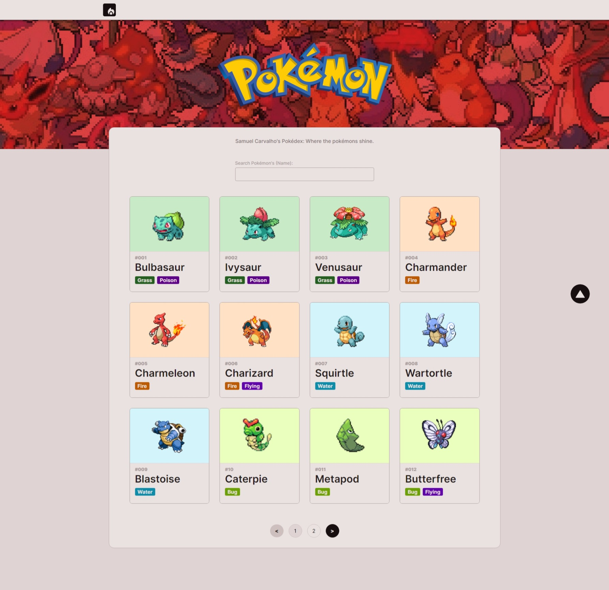

<h1 align="center">
Pokédex w React Js/ Next Js and Typescript</h1>

<br />




<h2 align="center"><a href="https://samuelcarvalho.dev/projetos/pokemon" align="center"> 📷  CHECK OUT: LIVE DEMO! -></a></h2>

<br/>

<div align="center">
  <a href="#description">Description</a> &nbsp;&nbsp;&nbsp;|&nbsp;&nbsp;&nbsp <a href="#install">Install</a> &nbsp;&nbsp;&nbsp;|&nbsp;&nbsp;&nbsp <a href="#technologies">Technologies</a> &nbsp;&nbsp;&nbsp;|&nbsp;&nbsp;&nbsp <a ref="#related">Related</a> &nbsp;&nbsp;&nbsp;|&nbsp;&nbsp;&nbsp <a href="#references">References</a> &nbsp;&nbsp;&nbsp;|&nbsp;&nbsp;&nbsp <a href="#contact">Contact</a>
</div>

<br />
<br />

<h3 id="description">✍️ Description:</h3>

<p>This project was made with the latest technologies using <a href="https://github.com/samuelcarvalhodeveloper/NextJs-Typescript-Boilerplate-w-Styled-Components-and-SSR-Prettier-Eslint-Configurated">Next Js (v13)</a>.The biggest trump of <a href="https://github.com/samuelcarvalhodeveloper/NextJs-Typescript-Boilerplate-w-Styled-Components-and-SSR-Prettier-Eslint-Configurated">Next Js</a> is that,out of the box, offers <a href="https://github.com/samuelcarvalhodeveloper/NextJs-Typescript-Boilerplate-w-Styled-Components-and-SSR-Prettier-Eslint-Configurated">Server-Side-Rendering</a> with <a href="https://github.com/samuelcarvalhodeveloper/NextJs-Typescript-Boilerplate-w-Styled-Components-and-SSR-Prettier-Eslint-Configurated">Static-Site-Generation</a>,which gives us much more velocity and stability as public project - even i made as an educational project; This is a really robust project, for to study. Have Fun!</p>

<br />

<h3 id="install">🔍  Install:</h3>

<p>To create this project I have used React, but as long as I stated with npm, I think you are going to have problems to use with yarn.The best tip gave to you as a beginner is use npm or migrate to yarn, if all you want is just try - use npm:<p>

<br />

**To install the package:**

```npm install```

**To run correct script:**

```npm run dev```

<br />

**If you want to create production build:**

```npm run build```

<br />

<h3 id="technologies">🚀  Technologies:</h3>

<p>To build this project is used:</p>

- React Js
- Next Js
- Typescript
- Styled Components
- Npm
- Node
- Fetch API
- Static Site Generation
- Server Site Rendering
- Axios
- React Paginate

<br />

<h3 id="contact">✉️  Contact:</h3>

**Email:**
<a href="mailto:personal.samuelcarvalho@gmail.com">personal.samuelcarvalho@gmail.com</a>
